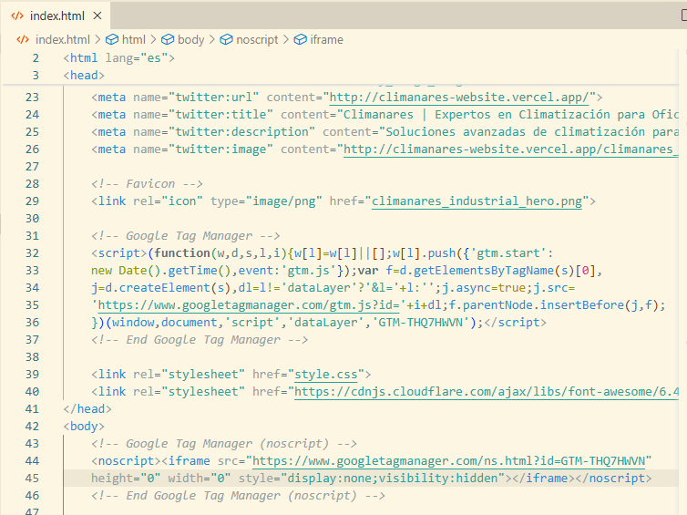

# Presentación de Avances

## 1. Código Implementado

*Descripción*: Captura del código fuente utilizado en el proyecto.

---

## 2. Flujo de Datos

*Descripción*: Diagrama que muestra el flujo de datos entre los componentes.

---

## 3. Prueba de Google Tag

*Descripción*: Resultado de la prueba de integración con Google Tag Manager.

---

*Fin de la presentación.*
